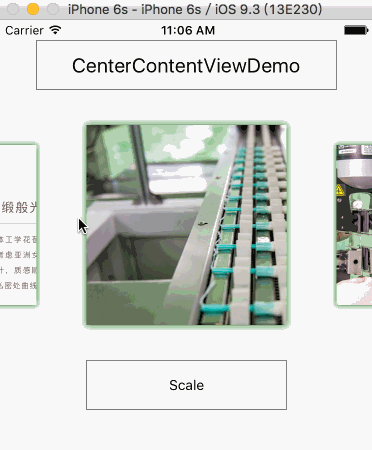

# CenterContentView

CenterContentView is a pure JavaScript component,and it can auto center cell with some simple transfrom animations when you move, slide or release.

## Demo



## Installation

`npm install react-native-center-content-view -save`

## Documentaion

### Usage
```javascript	
import CenterContentView from 'react-native-center-content-view';
	
class Demo extends Component {
	render() {
    	return (
        <CenterContentView/>
    	)	
      }
 }
```
### Examples
```
<CenterContentView
  style={{height:230,marginTop:20,backgroundColor:'#EBEBEB',alignItems:'center'}}
  space={30}
  scale={this.state.scale}
  opacity={this.state.opacity}
  rotateLeft={this.state.rotateLeft}
  rotateRight={this.state.rotateRight}
  data={SECTIONS}
  initialIndex={3}
  renderCell={this.renderCell.bind(this)}
/>
```
## Props
- `data` (Array) `null` - dataSource
- `renderCell` (Function)  - Cell Component
- `initialIndex` (Number:[1,+∞)] )`1` - intialIndex
- `space` (Number) `30` - the space between Cell to Cell 
- `scale` (Number:[0,1]) `1` - scale of the Cell that do not on the center of CenterContentView,
- `opacity` (Number:[0,1]) `1` - opacity of the Cell that do not on the center of CenterContentView,
- `rotateLeft` (String) `"0deg"` - rotate of the Cell that on the left of CenterContentView,
- `rotateRight` (String) `"0deg"` - rotate of the Cell that on the right of CenterContentView,


